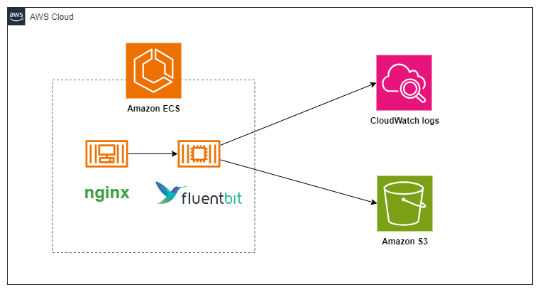

## このリポジトリは

FirelensとFirehoseを素振りするためのリポジトリ。

## 構成

nginxとfirelensを同一タスクで動かし、nginxのログをfirelensでcloudwatchlogsとS3に出力する。




各コンテナは以下から取得

- nginxはdockerhubから取得
- firelensはfluentbitを使用し、AWSから取得

## 使い方

1. terraformでインフラを構築する
2. extra.confをs3にアップロードする
3. タスク定義を登録する
4. タスクをECSにデプロイする

動かない場合は、コードを書き換える。特にS3はバケット名が一意となる必要がある。

## extra.confをs3にアップロードする

```bash
aws s3 cp extra.conf s3://fluent-bit-yamada
```
## タスク定義の登録

```bash
aws ecs register-task-definition --cli-input-json file://task-def.json
```

## ECSへのデプロイ

```bash
aws ecs update-service --cluster stag-yamada-ecs --service stag-yamada-nginx-service --task-definition stag-yamada-nginx-def
```


