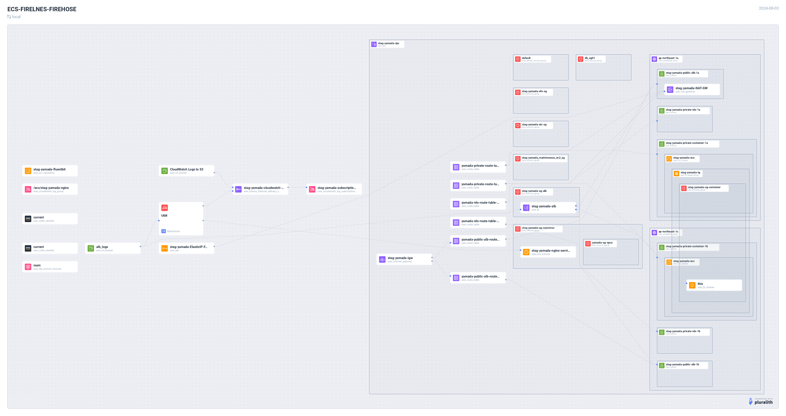

- [1. このリポジトリは](#1-このリポジトリは)
- [2. 構成](#2-構成)
  - [2.1. 構成図](#21-構成図)
  - [2.2. やっていること](#22-やっていること)
  - [2.3. コンテナイメージの取得元](#23-コンテナイメージの取得元)
- [3. 使い方](#3-使い方)
- [4. 参考：使用したコマンド](#4-参考使用したコマンド)
  - [4.1. extra.confをs3にアップロードする](#41-extraconfをs3にアップロードする)
  - [4.2. タスク定義の登録](#42-タスク定義の登録)
  - [4.3. ECSへのデプロイ](#43-ecsへのデプロイ)


## 1. このリポジトリは

firelensとfirehoseを素振りするためのリポジトリ。

## 2. 構成

### 2.1. 構成図

素振りの構成は以下の構成。



PlurarithはKinesis関連のサービスが表示されない。

### 2.2. やっていること

nginxとfirelensを同一タスクで動かし、nginxのログをfirelensでcloudwatchlogsとS3に出力する。(いわゆる、ログのルーティング)

firelensそのもののログ（起動して初期化していることがわかるログ）はfirehose経由でS3に出力する。

### 2.3. コンテナイメージの取得元

各コンテナイメージは以下から取得している。

- nginx：AWSからイメージを取得
- firelens：fluentbitを使用している。また、AWSからイメージを取得。（fluentdではなく、fluentbit）

## 3. 使い方

1. terraformでインフラを構築する
2. extra.confをs3にアップロードする
3. タスク定義を登録する
4. タスクをECSにデプロイする

動かない場合は、コードを書き換える。とくにタスク定義にアカウントIDを明記しているし、S3はバケット名が一意となる必要がある。

firelensは起動時にS3に格納している```extra.conf```を読み込む仕組みとしている。そのため、```extra.conf```を書き換えたら、タスクをデプロイし直すこと。

## 4. 参考：使用したコマンド

### 4.1. extra.confをs3にアップロードする

```bash
aws s3 cp extra.conf s3://fluent-bit-yamada
```
### 4.2. タスク定義の登録

```bash
aws ecs register-task-definition --cli-input-json file://task-def.json
```

### 4.3. ECSへのデプロイ

```bash
aws ecs update-service --cluster stag-yamada-ecs --service stag-yamada-nginx-service --task-definition stag-yamada-nginx-def
```

aws ecs execute-command

aws ecs execute-command \
--cluster stag-yamada-ecs \
--task arn:aws:ecs:ap-northeast-1:449671225256:task/stag-yamada-ecs/607635599f4148c18bfe7f72774cb912 \
--container log_router \
--interactive \
--command "kill -KILL -1" 


aws ecs execute-command \
  --cluster stag-yamada-ecs \
  --task arn:aws:ecs:ap-northeast-1:449671225256:task/stag-yamada-ecs/57f00fb643c74df282b5187c938473d7 \
  --container log_router \
  --interactive \
  --command "/bin/sh"


aws ecs execute-command \
--cluster stag-yamada-ecs \
--task arn:aws:ecs:ap-northeast-1:449671225256:task/stag-yamada-ecs/a710f676562a4f5a8868003cb2ca5d1a \
--container log_router \
--interactive \
--command "kill -SIGTERM 1"


aws ecs list-tasks --cluster stag-yamada-ecs --service-name stag-yamada-nginx-service
